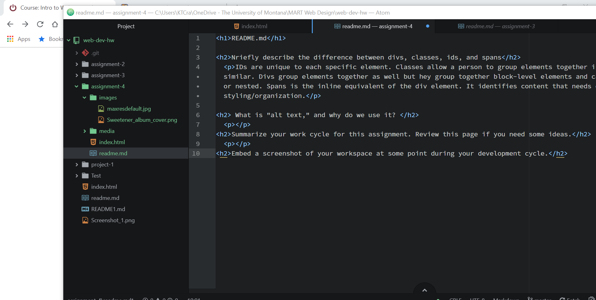

<h1>README.md</h1>

<h2>Nriefly describe the difference between divs, classes, ids, and spans</h2>
  
IDs are unique to each specific element. Classes allow a person to group elements together if they are similar. Divs group elements together as well but hey group together block-level elements and can be singular or nested. Spans is the inline equivalent of the div element. It identifies content that needs extra styling/organization.

<h2> What is "alt text," and why do we use it? </h2>
  
Alt text provides a test description of the image which describes the image if you can't see it. 

  
We use alt text because the search engines rely on the descriptions used to find hte images. It also helps the images show up in the results of image-based searches. 

<h2>Summarize your work cycle for this assignment. Review this page if you need some ideas.</h2>
  

<h2>Embed a screenshot of your workspace at some point during your development cycle.</h2>
  
