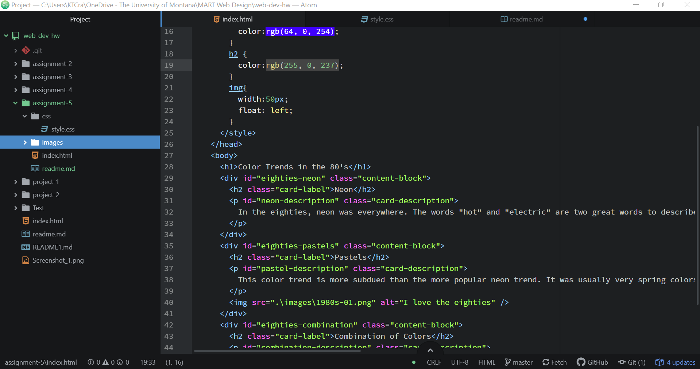

<h1> README.md</h1>

<h2>Briefly share your design research for this assignment. What graphic or graphics did you choose, from what decade? How did you try to style your "art page" to reflect your exploration of this decade's design trends?</h2>
  
I chose the "I love the 80s" graphic. This page reflected the exploration of the 80s because the colors reflect the colors that were popular in fashion and interior design then. There are neon colors and pastels meshed together which correctly show off what the eighties were all about.

<h2>Describe your color palette, including the 3 colors you chose. List their color names, rgb values, or hex codes.</h2>
  
My three colors were rgb(0, 255, 237), rgb(64, 0, 254), and rgb(255, 0, 237). together all of these colors represent the crazy, eye hurting color themes of this legendary decade.

<h2>Embed a screenshot of your workspace at some point during your development</h2>
  
