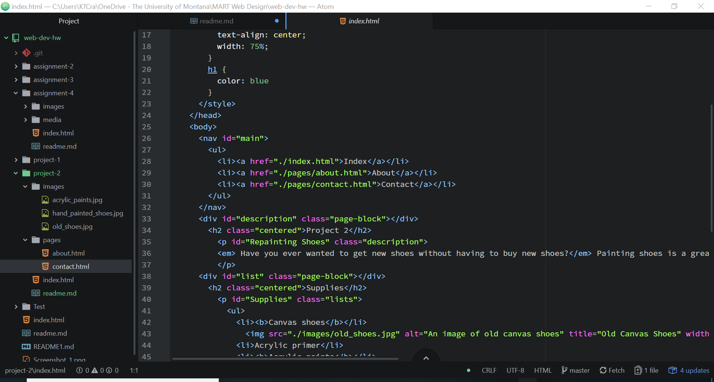

<h1>README.md</h1>

<ol>
  <li>Briefly recap your experience learning HTML. What was new, old, interesting, or difficult to learn?</li>
    <ul>
      <li>I thought that the interesting thing for HTML is how everything is similar yet different. Everything has it's own unique thing but everything works together in basically the same way.</li>
      <li>It was difficult to learn about the spans, divs, ids, and classes for me. Just identifying them as something different and seeing their use is hard for me.</li>
    </ul>
  <li>Next Topic we begin CSS and expand on styling, which helps us "decorate" HTML. Is there anything you're anxious or excited to learn about in this new section?</li>
    <ul>
      <li> I'm excited because the styling is what makes everything look good to me and that is what I strive for. To have anything not be aesthetic or organized is hard for me.</li>
      <li> I'm anxious because I didn't fully comprehend the styling using HTML and I'm sure I'll have difficulty with this as well.</li>
    </ul>
  <li>Embed a screenshot of your workspace at some point during your develepment cycle<li>
    
</ol>
